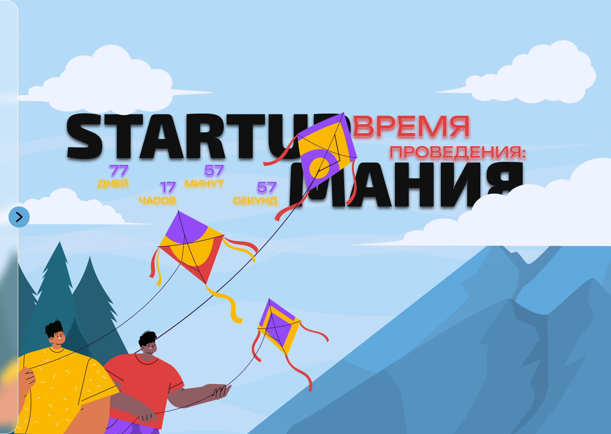
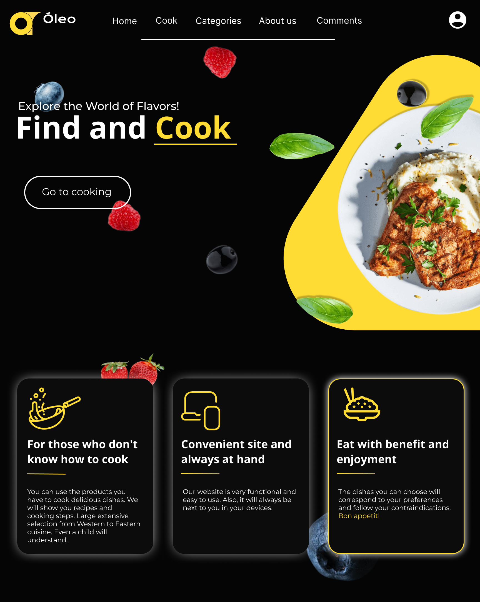
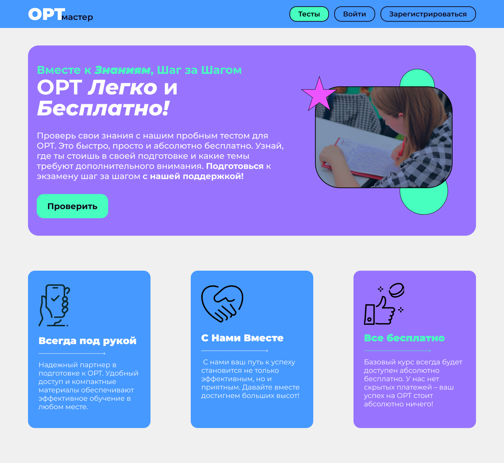
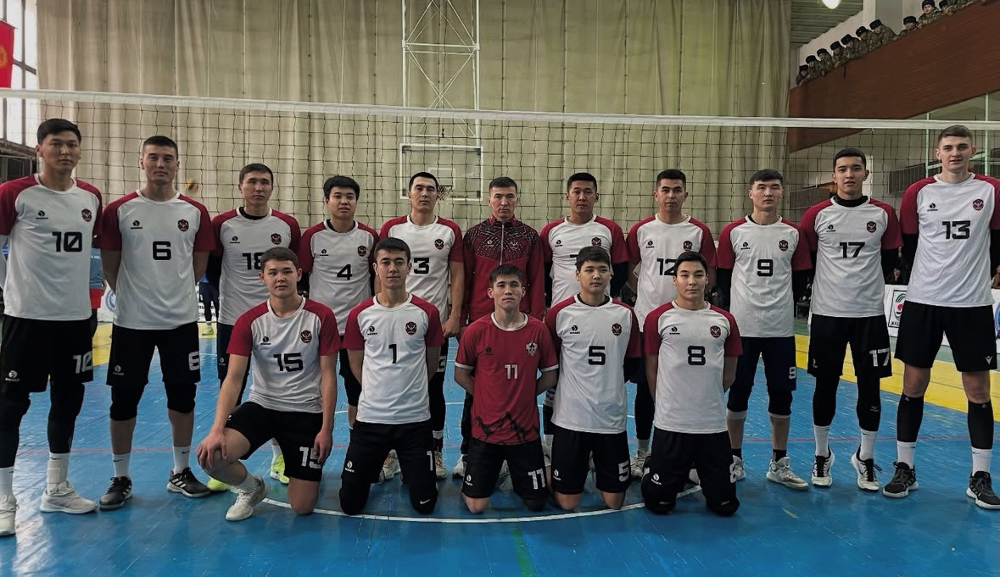

# 🎨 Portfolio

## 👋 Who am I

Hi! I'm **Kutmansher** — a UX/UI designer, model/actor, and volleyball player.  
This is my creative and professional portfolio — welcome!

## 💼 About Me

- 🎓 Graduate in Software Development from the College under Ala-Too International University  
- 🎨 Transitioned into UX/UI Design after working on real client projects  
- 👔 Working as a model and actor, frequently involved in fashion shows and creative shoots in Bishkek  
- 🧠 Passionate about psychology, storytelling, and how people think and feel  
- 🏐 Played in Kyrgyzstan’s top volleyball league; captain of the Ala-Too International University volleyball team  
- 🌟 Represented my hometown of Samara, Russia in youth volleyball competitions  
- 🎯 My dream is to become a **Senior UX/UI or Product Design Team Lead** in a successful company, continue playing volleyball at a high level, and one day act in a movie

## 🛠️ Skills

- **UX Research** – user interviews, personas, journey maps, usability testing  
- **UI Design** – wireframing, prototyping, layout & visual design  
- **Design Tools** – Figma, Adobe XD, Photoshop, Illustrator  
- **Development & Collaboration** – HTML/CSS, basic JavaScript & React, GitHub, Python, Java, and databases  
- **Soft Skills** – creativity, leadership, communication, teamwork

---

## 📁 Featured Projects

### 1. 💡 Startup Community Platform  
Designed a platform to support aspiring startup founders.  
🔗 [View Case Study on Behance](https://www.behance.net/gallery/201445771/Startup-Maniya-website-UX-UI)  
📸 

---

### 2. 🍳 Smart Cooking App – *Oleo*  
AI-powered assistant that helps users plan and cook meals.  
My first project as a frontend developer.  
📸 

---

### 3. 🧠 ORT Master – Exam Preparation Platform  
Created during a hackathon with my team. The platform helps students prepare for ORT exams.  
(Interesting fact: average score is ~150, mine was 183 without preparation)  
📸 

---

### 4. 🖥️ IT Fest Projects  
As a frontend team lead, I developed 3 websites for the IT Fest 2024:  
- [It Fest Main Site](https://github.com/EnderKru/It-Fest)  
- [Mobilograph Competition](https://github.com/EnderKru/bobby-mobilography)  
- [KIA CyberChamp](https://github.com/manziro785/kia)

---

## 🏅 Sports Portfolio

### 🏐 Volleyball  
- Represented **Samara**, Russia in youth competitions (MVP & awards)  
- Played for **IT MIA** (Top-5 team in Kyrgyzstan)  
- Captain of **AIU volleyball team** (placed 4th in national league)  
📸   
📸 

### 🥋 Judo  
Practiced for 7 years and won numerous awards across Russian cities.  
Unfortunately, I had to leave my medals in Samara.

---

## 🌐 Media Links

- 🎨 [Behance](https://behance.net/enderkru)  
- 💼 [LinkedIn](https://www.linkedin.com/in/kutmansher-ermekov-730740349/)  
